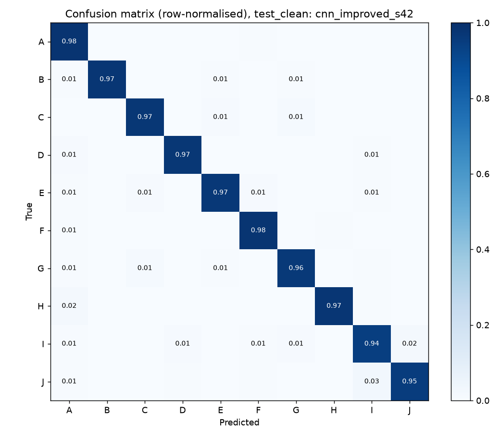
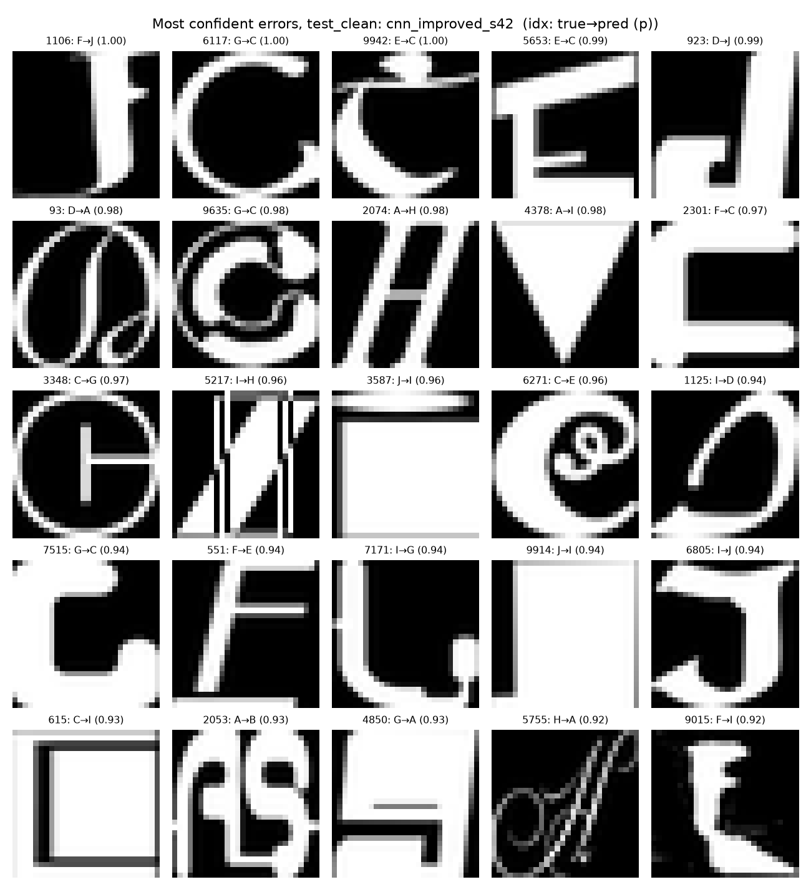
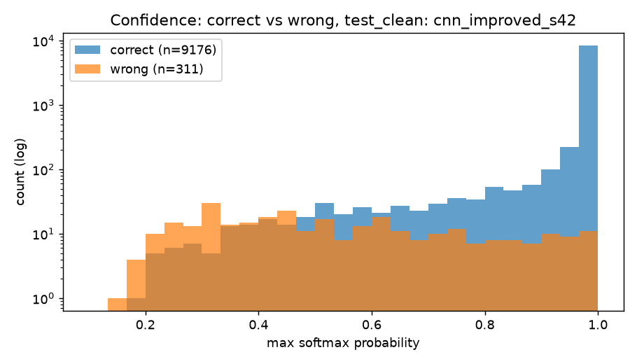

# notMNIST letter recognition: from MLP to transfer learning

A PyTorch project on notMNIST (28x28 font-rendered letters A-J). It started as a CPSC 433 Keras assignment and was rebuilt as a small computer-vision study: a leak-free data split, a ladder of models (MLP, CNN, improved CNN, ResNet-18 as frozen probe, fine-tune and from-scratch), evaluation with confidence intervals, McNemar tests and calibration, an error analysis, and a command-line predictor.

## Results

Primary metric: accuracy on **test_clean** (n = 9,487), the official test images that do not appear in the training set. Test_official (n = 10,000) is in `reports/results.md`. Every row below is from a single seed (42).

| run | params | test_clean acc [95% CI] | macro-F1 | ECE |
|---|---:|---:|---:|---:|
| resnet18_probe_s42 | 11,181,642 | 87.28% [86.59-87.93] | 0.8731 | 0.0433 |
| legacy_keras_mlp | 203,530 | 92.82% [92.28-93.32] | 0.9275 | 0.0075 |
| mlp_baseline_s42 | 203,530 | 93.20% [92.68-93.69] | 0.9316 | 0.0059 |
| cnn_baseline_s42 | 462,858 | 94.62% [94.15-95.06] | 0.9458 | 0.0287 |
| legacy_keras_cnn | 462,858 | 94.91% [94.45-95.33] | 0.9486 | 0.0304 |
| resnet18_scratch_s42 | 11,181,642 | 95.88% [95.46-96.26] | 0.9583 | 0.0051 |
| resnet18_finetune_s42 | 11,181,642 | 96.02% [95.60-96.39] | 0.9598 | 0.0042 |
| cnn_improved_s42 | 288,618 | 96.72% [96.34-97.06] | 0.9668 | 0.0047 |

Produced by `python -m notmnist.evaluate runs/<run>` for each run, then `python -m notmnist.compare`. The full table (validation accuracy, test_official, NLL) and the McNemar ladder are in [`reports/results.md`](reports/results.md). The `legacy_keras_*` rows are the original submitted Keras models, scored on the same split.

<p align="center"> </p>
<p align="center"></p>

## Key findings

1. **The original test set leaks.** 513 of the 10,000 test images (5.1%) are byte-identical to training images. The training set has 1,761 internal duplicates (60,000 images, 58,239 unique), and 34 duplicate groups carry conflicting labels. Duplicates are removed before the stratified train/validation split, and the primary metric is computed on the 9,487-image test_clean subset. For the legacy Keras models the effect is small: 93.10% to 92.82% (MLP) and 95.12% to 94.91% (CNN) once the leaked images are dropped.
2. **The ladder.** The PyTorch ports land close to the Keras originals on the official test set: MLP 93.46% vs 93.10%, CNN 94.85% vs 95.12% (only the MLP pair was significance-tested; the CNN pair was not). The MLP difference is not significant on test_clean (McNemar p = 0.06568). The CNN beats the MLP (p = 1.077e-09), and the improved CNN beats the baseline CNN (p = 6.139e-27) with 288,618 parameters, 1.6x fewer than the original 462,858 (462,858 / 288,618 = 1.60). It is the most accurate model in the table at 96.72%.
3. **Transfer learning did not help here.** The frozen ImageNet probe is the worst model (87.28%). Fine-tuned ResNet-18 (96.02%) and ResNet-18 trained from scratch (95.88%) are not significantly different (McNemar p = 0.5044), so ImageNet pretraining gave no measurable gain on these 28x28 font glyphs in this setup. The fine-tuned ResNet-18 loses to the 288,618-parameter improved CNN (p = 3.248e-05); the from-scratch ResNet-18 also scores lower (95.88%), but that pair was not tested.
4. **Calibration.** The 50-epoch baseline CNN is the worst-calibrated of the CNN and fine-tuned ResNet models (ECE 0.0287, NLL 0.2703; the frozen probe's ECE is higher at 0.0433, but it is also far less accurate); the improved CNN has ECE 0.0047 and NLL 0.1049. The legacy Keras CNN is similar to the baseline (ECE 0.0304).
5. **Errors.** The improved CNN makes 311 errors on test_clean. The largest confusion is J predicted as I (29 errors, 9.3%), and the 10 most frequent (true, predicted) pairs together account for 125 of the 311 errors (40.2%, computed from the table in `reports/error_analysis.md`). In a manual audit of the 25 most-confident errors (my own judgement from viewing the grid, so subjective): 4 look mislabelled, 9 are unreadable or decorative, 6 look like genuine model mistakes, and 6 are ambiguous. See [`reports/error_analysis.md`](reports/error_analysis.md).

## Quickstart

```bash
python -m venv .venv && source .venv/bin/activate
pip install -e ".[dev]"                 # PyTorch, torchvision, scikit-learn, pytest, ...
pytest -q

python -m notmnist.train --preset cnn_improved --seed 42     # writes runs/cnn_improved_s42/
python -m notmnist.evaluate runs/cnn_improved_s42            # metrics.json on test_clean / test_official
python -m notmnist.compare                                   # reports/results.md + McNemar ladder
python -m notmnist.error_analysis                            # reports/error_analysis.md + figures
python -m notmnist.predict path/to/letter.png --top-k 3      # uses models/notmnist_cnn_improved.pt
```

If `import notmnist` fails after the editable install (seen on macOS when the venv's `.pth` file gets the hidden flag), prefix the commands with `PYTHONPATH=src`.

Presets: `mlp_baseline`, `cnn_baseline`, `cnn_improved`, `resnet18_probe`, `resnet18_finetune`, `resnet18_scratch`. `runs/` is gitignored; `models/notmnist_cnn_improved.pt` (1.2 MB, the `cnn_improved_s42` checkpoint) is the one committed checkpoint.

Example: a test_clean image (official test index 0, true label F) saved as a PNG:

```
$ python -m notmnist.predict test0.png --top-k 3
{
  "model": "cnn_improved",
  "predictions": [
    { "label": "F", "index": 5, "prob": 0.9999998807907104 },
    { "label": "E", "index": 4, "prob": 3.4881054489233065e-08 },
    { "label": "A", "index": 0, "prob": 2.4776300122653083e-08 }
  ]
}
```

The CLI prints the JSON indented one field per line; it is condensed above. The original hand-drawn sample `legacy/keras_part1/image.png` gives A (prob 0.9729), F (0.0231), G (0.0033); I did not record which letter was drawn, so I make no accuracy claim for it.

## Project structure

```
src/notmnist/   data.py (dedup + splits), models.py, train.py, evaluate.py, metrics.py,
                compare.py, error_analysis.py, inference.py, predict.py
tests/          pytest for data, models, metrics, inference, training, reports
reports/        results.md/json, mcnemar.json, error_analysis.md, figures/
models/         notmnist_cnn_improved.pt (demo checkpoint)
data/           notMNIST.npz
legacy/         original Keras/TensorFlow coursework (read-only)
PROJECT_GUIDE.md  audit, design and scope
```

## Origins

The project began as a CPSC 433 (Fall 2025) assignment, preserved unchanged in [`legacy/`](legacy/README.md). Course-template scripts in `legacy/keras_part1/` were written by Jonathan Hudson and keep that attribution. The legacy Keras models are evaluated here on the same leak-free split so the PyTorch ports have a like-for-like reference.

## Limitations

- Single seed (42) per run. Multi-seed mean +/- std was not run, so small gaps between neighbouring rows should not be over-read; the McNemar tests only cover test-set sampling noise, not seed variance.
- Training ran on Apple MPS, where bitwise determinism is not guaranteed. Seeds and configs are saved, but rerunning may give slightly different numbers.
- Phase 2 items not done: FastAPI service and Docker image. There is no API; the only inference interface is the CLI.
- Hand-drawn input is out of distribution: the models were trained on rendered fonts only, and no hand-drawn evaluation set was built.
- The error-analysis audit is manual and subjective.
- One dataset (notMNIST); nothing here says how the ranking would look on other data.
