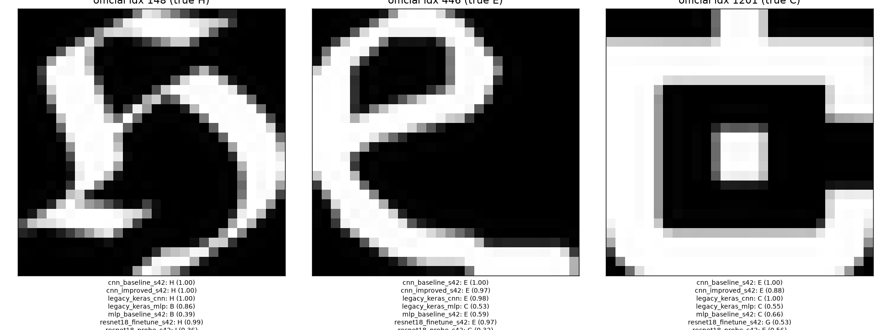

# Error analysis

Best model: `cnn_improved_s42`; baseline: `mlp_baseline_s42`; test_clean n = 9487. Best-model errors: 311.

## Top-10 confused pairs (cnn_improved_s42)

| true | pred | count | % of errors |
|---|---|---|---|
| J | I | 29 | 9.3% |
| H | A | 15 | 4.8% |
| I | J | 14 | 4.5% |
| C | G | 13 | 4.2% |
| G | C | 12 | 3.9% |
| D | A | 10 | 3.2% |
| C | E | 8 | 2.6% |
| E | C | 8 | 2.6% |
| E | F | 8 | 2.6% |
| I | G | 8 | 2.6% |

## Per-class F1 (mlp_baseline_s42 vs cnn_improved_s42)

| class | mlp_baseline_s42 | cnn_improved_s42 | delta (best - baseline) |
|---|---|---|---|
| A | 0.945 | 0.960 | +0.015 |
| B | 0.920 | 0.981 | +0.061 |
| C | 0.947 | 0.970 | +0.024 |
| D | 0.938 | 0.977 | +0.038 |
| E | 0.938 | 0.970 | +0.032 |
| F | 0.951 | 0.972 | +0.020 |
| G | 0.942 | 0.960 | +0.019 |
| H | 0.938 | 0.975 | +0.037 |
| I | 0.864 | 0.938 | +0.074 |
| J | 0.933 | 0.965 | +0.032 |

## Fixed / introduced errors

Baseline `mlp_baseline_s42` -> best `cnn_improved_s42`: fixed 415 (baseline wrong, best right), introduced 81 (baseline right, best wrong).

## Coursework indices (official test set)

| run | idx 148 | idx 446 | idx 1201 |
|---|---|---|---|
| cnn_baseline_s42 | H (1.00) | E (1.00) | E (1.00) |
| cnn_improved_s42 | H (1.00) | E (0.97) | E (0.88) |
| legacy_keras_cnn | H (1.00) | E (0.98) | C (1.00) |
| legacy_keras_mlp | B (0.86) | C (0.53) | C (0.55) |
| mlp_baseline_s42 | B (0.39) | E (0.59) | C (0.66) |
| resnet18_finetune_s42 | H (0.99) | E (0.97) | G (0.53) |
| resnet18_probe_s42 | I (0.36) | G (0.32) | E (0.56) |
| resnet18_scratch_s42 | H (1.00) | E (0.80) | E (0.76) |

## Figures

## Observations

- **Confusable pairs.** The largest error cell is J→I (29 of 311 errors, 9.3%), plus I→J (14): in many fonts both letters are a single vertical stroke and differ only by a small hook or serif. C↔G (13 + 12) differ by the small spur on G, which some fonts shrink or omit. H→A (15) and D→A (10) are the next largest; in the confusion matrix, the A column takes 0.01–0.02 of almost every row, so A is the model's most common wrong guess.
- **Label-noise audit of the 25 most-confident errors** (manual judgement from viewing the grid, not a measured quantity): 4 look mislabelled (the predicted letter looks right, e.g. idx 2074 labelled A looks like an italic H), 9 are unreadable, decorative or near-blank (filled boxes, stripes, outlines; e.g. idx 615, 9914, 5217), 6 look like genuine model mistakes (e.g. idx 5653, a clear E predicted as C), and 6 are ambiguous. So at least 13 of the 25 most-confident "errors" are not clear-cut mistakes by the model.
- **Confidence.** The 9176 correct predictions are concentrated in the top bin (≈1.0, about 10^4 on the log axis). The 311 wrong predictions are spread roughly evenly from about 0.15 to 1.0, at around 10–30 per bin, so a low max-probability is a useful but incomplete warning sign: about 10 errors still sit in the 0.97–1.0 bin. Overall calibration is good (ECE 0.0047, NLL 0.1049 on test_clean).
- **Coursework indices.** Index 148 (H, a script glyph) is predicted H by every CNN and ResNet except the linear probe (I, 0.36); both MLPs say B. Index 446 (E) is E for 6 of 8 models. Index 1201 (labelled C) splits the models: E ×4 (including cnn_improved at 0.88), C ×3 (legacy_keras_cnn and both MLPs), G ×1. Judgement: the glyph is a squared outline with an inner square and a tab on top, open on the right; it could be read as a blocky C, but it is ambiguous, and the E predictions are understandable.
- **Per-class F1.** Every class improved from mlp_baseline_s42 to cnn_improved_s42. I gained the most (0.864 → 0.938, +0.074), followed by B (+0.061), but I is still the weakest class, consistent with the J↔I confusion above.
- **Error turnover.** The best model fixes 415 of the baseline's errors and introduces 81 new ones, so its gain is not just a subset of the baseline's correct answers.

